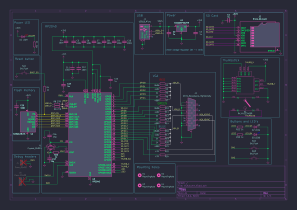
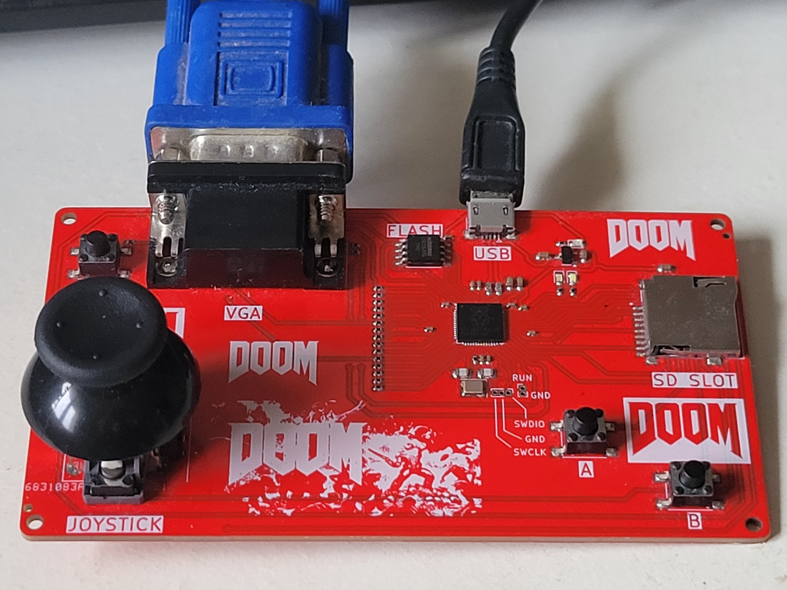
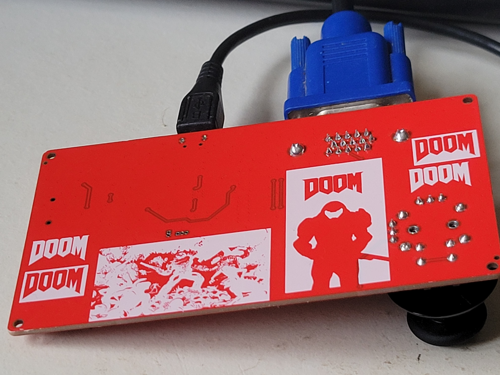

# VGAutumn

# Summary of the project

VGAutumn is a RP2040 VGA joystick PCB. This board allows to play different game using its VGA output and its inputs (joystick, buttons).

## Schematics

## Features

- Micro-USB connector to power and program the board
- LDO converter, 3V3 for the RP2040, Flash memory, SD card and joystick and LED
- 16 MB flash memory
- Boot button to put the RP2040 in USB storage mode
- VGA connector linked to the RP2040 through a resistor ladder (cheap DAC)
- Joystick (vertical, horizontal and pushable) with two buttons
- micro-SD card reader
- 3 LEDS, White, Blue LED and a Red power LED
- Expose the debug pins

## PCB caracteristics

The PCB is a two layer board with single-sided assembly, the thinnest trace is 0.2 mm and the vias have a 0.7 mm diameter ring and a 0.3 mm hole. The USB traces are as short and as thick as possible to be as close as possible to the 90 $\Omega$ impedance of the JLCPCB two-layer board stackup.

## Board results :

## Programming

The board can be programmed in Python through the Thonny IDE, in C/C++ with CMake (VS Code, NVIM) and even (not tested) with the Arduino IDE.

The "pico-playgrounds" and "pico-examples" given by Raspberry are a great way to test the VGA output and the Joystick.

To run Doom on the board, we can use the [RP2040-doom](https://github.com/kilograham/rp2040-doom) by kilograham (congratulations to him for this amazing work), the first release of "doom1-usb.uf2" work out of the box because the board use the default VGA pins.

Note : To make Doom responds to Joystick and buttons inputs, you need to modify the code in the pico folder.

## Current Issues and TO DO list

- Doom use the SDL2 library to get input from USB HID devices (Keyboard, Joystick) while we use GPIO's to connect the joystick and buttons. It means that the code need to modified to get the inputs.
- Doom needs more than 3 buttons and a joystick to be fully playable, future versions could include an additional USB port for power to connect a keyboard to the first one
- The board doesn't implement nor expose any way to have sound output
- The micro-SD reader isn't used by RP2040-doom, it could be removed
- The joystick used works great on its vertical motion but the horizontal one is not smooth and the output values aren't in the same range
- The modified (ugly) version of RP2040-doom wich detect joystick and buttons should be uploaded soon (only works in the main menu for some reason)

